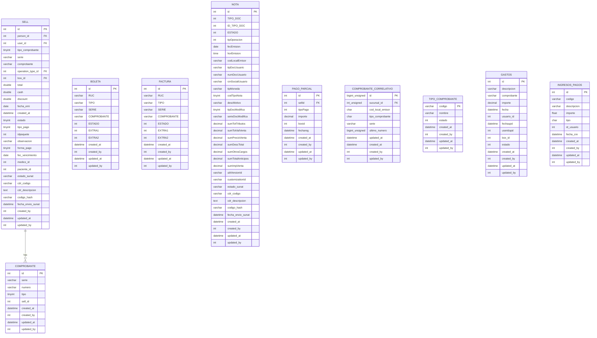
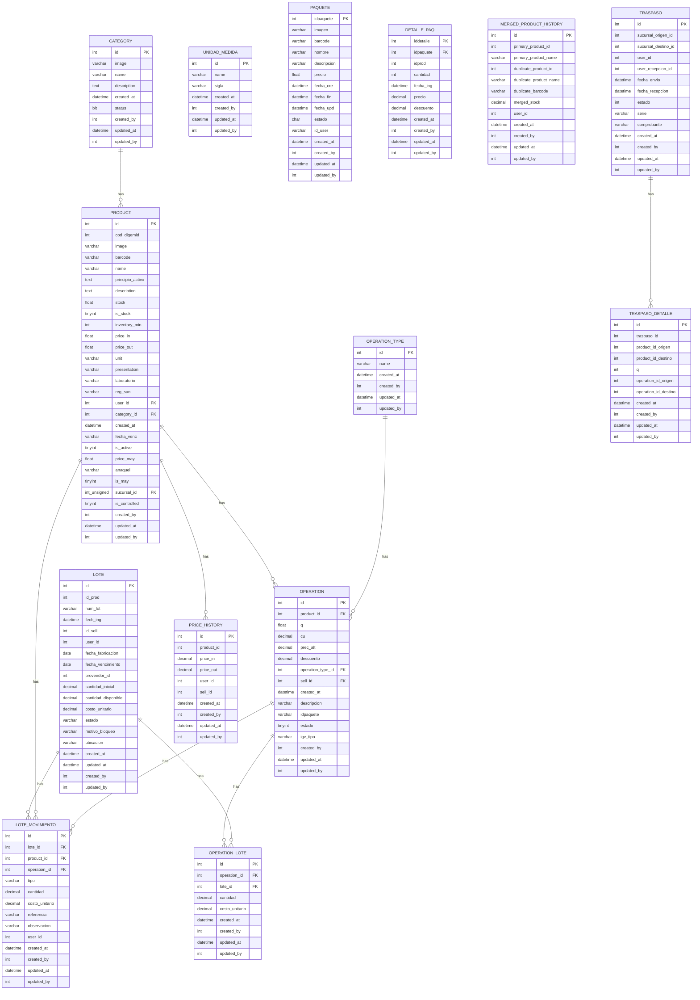
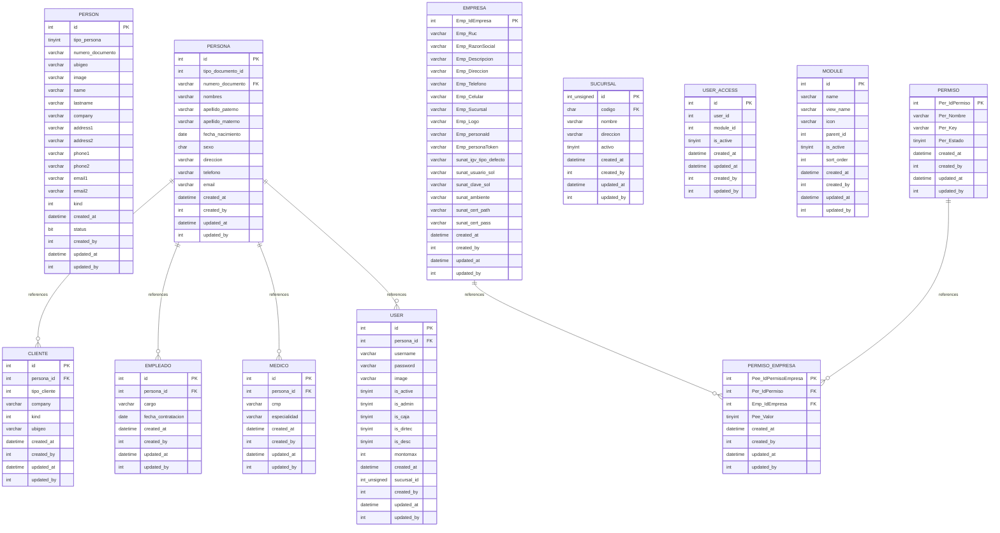
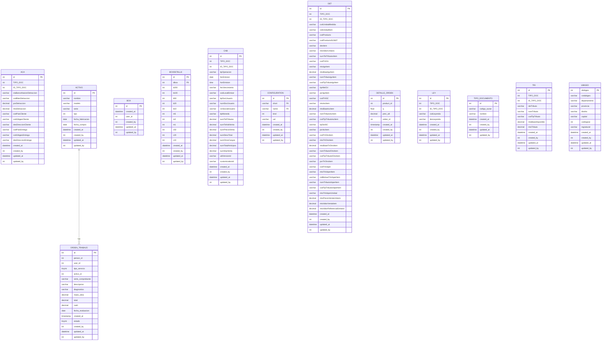

# Diagramas Entidad-Relación por Módulo

Dado el gran tamaño de la base de datos, el diagrama ha sido dividido en módulos para facilitar su visualización y lectura sin requerir un zoom excesivo.

## Ventas y Comprobantes

## Inventario y Productos

## Personas y Usuarios

## Otros Módulos (SUNAT, Órdenes, etc)

